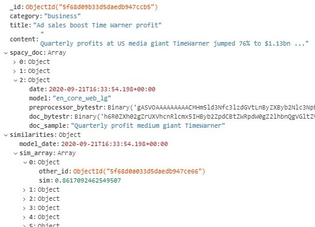

## BBC News Article ML System
This is a POC for an NLP system that could be used to serve articles along with "similar reads". The heavy lifting of the NLP is done with spaCy. With spaCy, the article contents are transformed into Doc objects, and when these Doc objects are created with a larger model (such as en_core_web_md or en_core_web_lg) the tokens and the document as a whole are transformed into vectors. Doc objects also conveniently have a .similarity() method to compare the similarity of tokens/spans/Docs. For this application I compare Docs.     I wrote a CLI to run the pipeline from reading the data from the filesystem to to storing the Doc objects in MongoDB. The pipeline has two stages. The first stage performs a file reads by scanning the dir and loading the data for title, category, and content into the DB backend. The second stage reads what was just written to the DB to create Doc objects which are then placed back in the Mongo collection.     This intermediate write, while not ideal, was the best solution at the moment. Ideally, I'd like to go from file read to Doc without the need to write to DB. However, this would mean that the data would need to either fit in memory (assume not possible for big data applications),have the Doc created on the fly for each article (spaCy documentation advises to avoid doing this for performance reasons), or keep a generator alive for both the article info entry and the bulk Doc creation. I currently use generators but I have not been able to find a solution yet to the problem with this implementation. The issue is that, in order to use the .pipe() method in spaCy, I need another generator or to find a way to prepare the file read data for bulk insert while not exhausting the generator. Another generator would mean another dir scan because that is where the data lives (without an intermediate DB write). I've looked into how to simultaneously do these things but moved on to get a POC and can return to see if optimizations are possible there.     Another pipeline that will be able to run from a CLI is the similarity pipeline. This takes the Docs for a specified model (date) and stores the similarities for all pairwise comparisons. The thought is that I will just store the active model's results. Should the system need to revert to another model, the similarity pipeline can be run again with that model to overwrite the active model (the Doc created by previous models will still be stored).     The system is currently written to be plugged into a MongoDB backend but I hope to also do a SQLite version as well to really hammer in the different approaches for SQL vs NoSQL DBs. I'm new to NoSQL and MongoDB so this project was used to help give me experience with the technology and grow my stack. I'm sure there are better ways to do somethings and I look forward to figuring those ways out.     The API can be used to enter a title and GET a the article back along with the recommendations (still in development). I also plan to allow the API to take in new articles and "publish" them by adding them to the DB and updating the active model to include the newly published article.

### How the vectorization & similarity work
The spaCy documentation seems to indicate that the word vectors are formed using word2vec or a similar algorithm. Each token in the Doc is given a word embedding (vector) and then the Doc gets its vector by averaging the vectors of all tokens in the Doc. The similarity is the cosine similarity between two vectors. The higher the similarity, the more similar the articles are.

### Data
The official description from the source:
> Consists of 2225 documents from the BBC news website corresponding to stories in five topical areas from 2004-2005. Natural Classes: 5 (business, entertainment, politics, sport, tech)
> 
> If you make use of the dataset, please consider citing the publication: 
> - D. Greene and P. Cunningham. "Practical Solutions to the Problem of Diagonal Dominance in Kernel Document Clustering", Proc. ICML 2006.
>
> All rights, including copyright, in the content of the original articles are owned by the BBC.
>
> Contact Derek Greene <derek.greene@ucd.ie> for further information. http://mlg.ucd.ie/datasets/bbc.html

However, while working on the data, I found that 2096 of the 2225 articles were actually unique. Although the number of articles is relatively small, considerations were made to make this work on an out-of-memory dataset such as using generators rather than loading entire data into memory. Eventually, considerations in multiprocessing can take place.

### Results
I have run the preprocessing pipeline and the similarity pipeline to perform the "initial load" of the system. Running the similarity pipeline takes quite a bit of time, which is not suprising, but there may be improvements to be made. The MongoDB looks like this for a given news article:      The preprocessing pipeline is written to fill the category, title, content, and spacy_doc fields. The spacy_doc field is an array of objects. Each object corresponds to a run of the preprocessing pipeline. The object stores the date of the model (as an identifier for the similarity pipeline), the spacy model name, the preprocessing function as a bytestr, the spacy Doc for the article as a bytestr, and a sample of the Doc's text as a quick way to check proper placement. This design allows for me to store different versions of the preprocessed article (differentiated by say the model or preprocessor function). Storing previous versions of models allows me to experiment or revert to an older model if needed.    The similarity pipeline calculates and stores the similarity measure for each pair of articles in the database. The data is stored in the similarities field as an object. Stored is the model_date (so it is known what model is "active") and an array. The array contains an object at each index which stores the \_id (other_id) of the other article being compared and the similarity score (sim) calculated between the two Docs. The idea is that the similarities field will only store one "active" model. The spacy_doc field stores the necessary data to build/rebuild a similarity model.    Now that we have an active model, let's take a look at how we can access the model.        The route is set as /article and it takes arguements title and nsimilar. The title is the title of the clicked-on article and nsimilar is an integer telling the backend the number of similar articles to return. We see that the data for the clicked-on article along with the similar articles that would be suggested to the reader are in the reponse. The order of the articles is not necessarily in a highest to lowest ranking but they are the top n similar articles. More formal model evauation should be used, but we can use this as a quick sanity check on our model to see that the similar articles make sense.    Since all of the calculations take place offline before the user clicks on an article, the response time is quick (19 ms). Learning and calculations take place offline but, in a real-world scenario, the set of articles in the database is not static--articles come and may even go. Each time an article is published to the system, new similarities must be calculated and stored. For my purposes, I'd like to keep the system live in its old state and update to the new state once all the new calculations have taken place. This system update is the next strecth of my work on this project.

### Next steps & considerations
Should I continue developing this system. There are a few things that should be visited/revisited:
 1. Testing.
 2. As I learn more about spaCy, I expect to find better ways to do some things. I know I could revisit the lemmatization step. The step cleans the text by removing stopwords, spaces, punctuation, and replacing tokens with their lemma. The variation in similarity seems kind of small so maybe some additional steps (e.g. NER) could help the system separate articles.
 3. The similarity measures are performed for each pair of Docs (the implementation works so that Doc1.similarity(Doc2) populates the info for article 1 and article 2 without the need for the redundant Doc2.similarity(Doc1)). However, calculating a similarity measure across categories is likely not necessary. We could use the human tagged category field or perform clustering on the Doc vectors.
 4. In the real world, a system like this should also consider relevancy in terms of time. Why recommend an article from several months ago even if they are similar? Using a publishing timestamp, the number of similarity measures needing calculated could be reduced even further by measuring only those within a certain time frame.   
 5. Take a look at custom training the word vector algorithm.
 6. Better DB integration (switching between dev, testing, and actual DBs) and more careful use of instantiating connections.
 7. In a production environment, look into DB sessions which may be helpful for 'locking' the DB because some things could get thrown off if updates are made to DB in between some lines of code.
